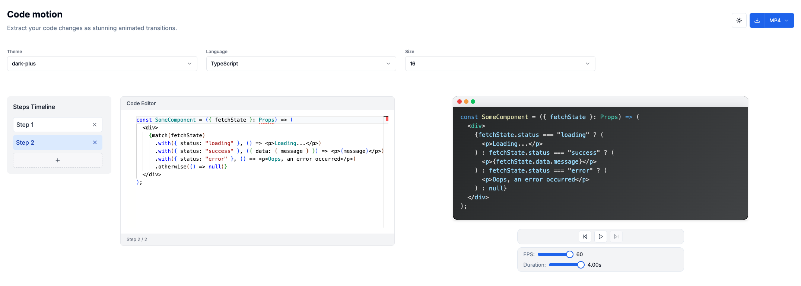

<h1 align="center">Code Motion</h1>

<p align="center">
Extract your code changes as stunning animated transitions.
</p>


## Introduction

**Code Motion** is a web application that visualizes the step-by-step evolution of code and allows you to export it as a video or GIF. It is designed to help developers, instructors, and technical writers clearly communicate code changes.



## Key Features

- **Step-by-step Code Editing**: Create and manage code in multiple steps.
- **Code Change Visualization**: Preview and play code transitions as animations.
- **Export as Video/Image**: Export code transitions as media files in mp4, gif, or webm formats.
- **Customizable Themes & Fonts**: Supports various code highlighting themes, fonts, and font sizes.
- **Responsive UI**: Optimized for both desktop and mobile environments.

## Tech Stack

- **Next.js** (App Router based)
- **React 19**
- **TypeScript**
- **Remotion** (Code transition video rendering)
- **@monaco-editor/react** (Code editor)
- **Zustand** (State management)
- **Tailwind CSS** (Styling)
- **Shadcn** (UI components)
- **Code Hike** (Code highlighting and transitions)

## Contributors

- **Project structure & tech selection**: Chat GPT
- **Prototyping & UI**: v0
- **Code implementation**: Cursor IDE
- **Integration & management**: @bang9

## Getting Started

### Prerequisites

- **pnpm** (9.15.3)

### Install and run the development server

```sh
pnpm install
pnpm dev
```

The app will be available at [http://localhost:3000](http://localhost:3000).

## License

This project is licensed under the MIT License.
